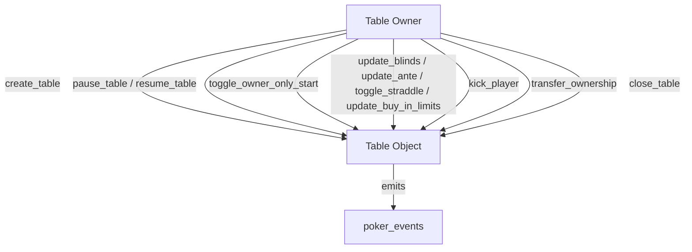

# NovaWallet Games — Admin & Operator Controls

This document is a ground‑up, exhaustive guide to **every administrative control** exposed by the contracts under `contracts/games`. It enumerates **who can do what**, **when**, and **how**, and calls out on‑chain constraints and multi‑signature behavior.

> Source of truth: Move modules in `contracts/games/sources` and `contracts/games/sources/poker`.

---

## 1) Admin Roles and Where They Live

### 1.1 Game Registry Admin (global)
**Module:** `NovaWalletGames::game_registry`  
**Storage:** `GameRegistry` at `@NovaWalletGames`

**Purpose:** Authorizes new games, issues game capabilities, and can deactivate/reactivate games.

**Single admin address:** `GameRegistry.admin`.

---

### 1.2 Chip System Admins (global)
**Module:** `NovaWalletGames::chips`  
**Storage:** `ChipManager` at `@NovaWalletGames`

**Roles:**
- **Primary admin** (`ChipManager.admin`)
- **Secondary admin** (`ChipManager.secondary_admin`, optional)
- **Tertiary admin** (`ChipManager.tertiary_admin`, optional)

**Key property:** Certain actions are **2‑step multisig** if more than one admin exists. See section 2.3.

---

### 1.3 Texas Hold’em Table Owner (per table)
**Module:** `NovaWalletGames::poker_texas_holdem`  
**Storage:**
- `Table` resource at a **Move Object address** (the table address)
- `TableRef` at the **owner address** (one table per owner)

**Role:** Each table has **exactly one owner** (`Table.owner`). The owner controls table configuration and operations.

---

## 2) Chip System Admin Controls (`NovaWalletGames::chips`)

### 2.1 Primary‑Admin‑Only Controls
These can only be executed by the primary admin address:

- **Transfer primary admin role**
  - `set_primary_admin(admin, new_admin)`

> Note: Primary admin is the only role that can reassign itself or set the top‑level admin.

---

### 2.2 Shared Admin Controls (Primary/Secondary/Tertiary)
These controls require **any** admin (primary, secondary, or tertiary):

**Economy configuration**
- `set_multiplier_price(admin, factor, price)` — add or update a multiplier offer.
- `remove_multiplier_option(admin, factor)` — remove an offer from the active list.
- `set_multiplier_duration(admin, duration_secs)` — affects future purchases only.
- `update_daily_free_chip_amount(admin, new_amount)` — set free claim amount (0 disables claims).
- `set_free_claim_period_seconds(admin, period_secs)` — must be > 0.
- `update_global_max_table_buy_in(admin, new_max)` — global cap enforced on new table creation.

**View/Monitoring** (non‑entry)
- `get_daily_free_amount()`
- `get_free_claim_period_seconds()`
- `get_multiplier_options()` / `get_multiplier_price(factor)`
- `get_multiplier_duration()`
- `get_global_max_table_buy_in()`
- `get_treasury_balance()` / `get_treasury_recipient()`
- `get_total_chip_supply()`

---

### 2.3 Multisig Governance Actions (2‑step)
**Functions**
- `initiate_governance_action(admin, action_type, target_address)`
- `approve_governance_action(admin, request_id)`
- `cancel_governance_action(admin, request_id)`

**Action Types**
1. **Update treasury recipient** — `target_address` = new treasury recipient.
2. **Set secondary admin** — `target_address` = new secondary admin.
3. **Remove secondary admin** — `target_address` ignored.
4. **Set tertiary admin** — `target_address` = new tertiary admin.
5. **Remove tertiary admin** — `target_address` ignored.

**Multisig Rule**
- If **secondary or tertiary admin exists**, the **approver must differ from the initiator** (`E_SELF_APPROVAL`).
- If **only the primary admin exists**, self‑approval is allowed.

**On‑chain observability**
- `get_governance_request(request_id)`
- `get_governance_requests_page(offset, limit)`

---

### 2.4 Treasury Withdrawals (2‑step)
**Functions**
- `initiate_treasury_withdrawal(admin, amount)`
- `approve_treasury_withdrawal(admin, request_id)`

**Multisig Rule**
Same as governance: if more than one admin exists, initiator must differ from approver.

**Notes**
- Withdrawals transfer CEDRA out of the treasury resource account to `treasury_recipient`.
- The contract enforces treasury balance checks both at initiation and approval.

**On‑chain observability**
- `get_withdrawal_request(request_id)`
- `get_withdrawal_requests_page(offset, limit)`

---

## 3) Table Owner Controls (`NovaWalletGames::poker_texas_holdem`)

### 3.1 Table Creation & Destruction
**Create a table** (caller becomes owner)
- `create_table(owner, small_blind, big_blind, min_buy_in, max_buy_in, ante, straddle_enabled, max_seats, table_speed, name, color_index)`

**Owner‑only teardown**
- `close_table(owner, table_addr)` — only allowed between hands; returns all seat stacks and removes the table.
- `cleanup_table_ref(owner)` — removes orphaned `TableRef` if the table no longer exists.

**One‑table‑per‑owner**
- The owner address stores a `TableRef`, so it can only have **one** table.

---

### 3.2 Ownership & Operational Controls
Owner‑only and **callable at any time** (even mid‑hand):
- `transfer_ownership(owner, table_addr, new_owner)`
- `pause_table(owner, table_addr)` / `resume_table(owner, table_addr)`
- `toggle_owner_only_start(owner, table_addr, enabled)`

**Behavioral notes**
- `pause_table` blocks **joining** and **starting** new hands; it does **not** stop an active hand.
- `owner_only_start` restricts `start_hand` to the table owner.

---

### 3.3 Table Configuration (Owner‑only, between hands)
Only allowed when **no hand is in progress**:
- `update_blinds(owner, table_addr, small_blind, big_blind)`
- `update_ante(owner, table_addr, ante)`
- `toggle_straddle(owner, table_addr, enabled)`
- `update_buy_in_limits(owner, table_addr, min_buy_in, max_buy_in)`
- `kick_player(owner, table_addr, seat_idx)` (refunds seat chips)

**Validations**
- `small_blind > 0`, `big_blind > small_blind`
- `min_buy_in > 0`, `max_buy_in >= min_buy_in`

**Important:** `update_buy_in_limits` does **not** re‑check the global max buy‑in; that check only exists in `create_table`.

---

## 4) Table Owner Control Flow (Diagram)

---

## 5) Immutable or Non‑Admin‑Editable Fields
The following values are **fixed at table creation** and **cannot be changed** in current code:
- `table_speed`
- `max_seats` (enforced as 5 in `create_table`)
- `name`
- `color_index`

There is **no fee/rake configuration** in the current poker contracts; fee‑related view values are placeholders.

---

## 6) Summary Matrix (Who Can Do What)

| Module | Action Group | Role Required |
| --- | --- | --- |
| `game_registry` | Register/deactivate/reactivate games | Registry Admin |
| `chips` | Economy settings | Any Chip Admin |
| `chips` | Primary admin rotation | Primary Chip Admin |
| `chips` | Governance actions | Any Chip Admin (2‑step if >1 admin) |
| `chips` | Treasury withdrawals | Any Chip Admin (2‑step if >1 admin) |
| `poker_texas_holdem` | Table lifecycle & config | Table Owner |

---

## 7) Operational Checklist (Quick Audit)

- ✅ Registry admin is set and known (`game_registry::get_admin`).
- ✅ Chip admins are correctly configured (primary/secondary/tertiary).
- ✅ Treasury recipient is valid and monitored.
- ✅ Tables are paused only for maintenance; active hands cannot be forcibly stopped by pause.
- ✅ Table config changes are done **between hands**.
- ✅ Ownership transfers update `Table.owner` only; table address remains unchanged.

---

If you need a compliance‑style checklist, or want this mapped to multisig tooling / on‑chain governance UI, say so.
