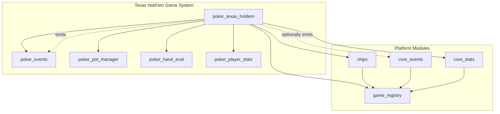
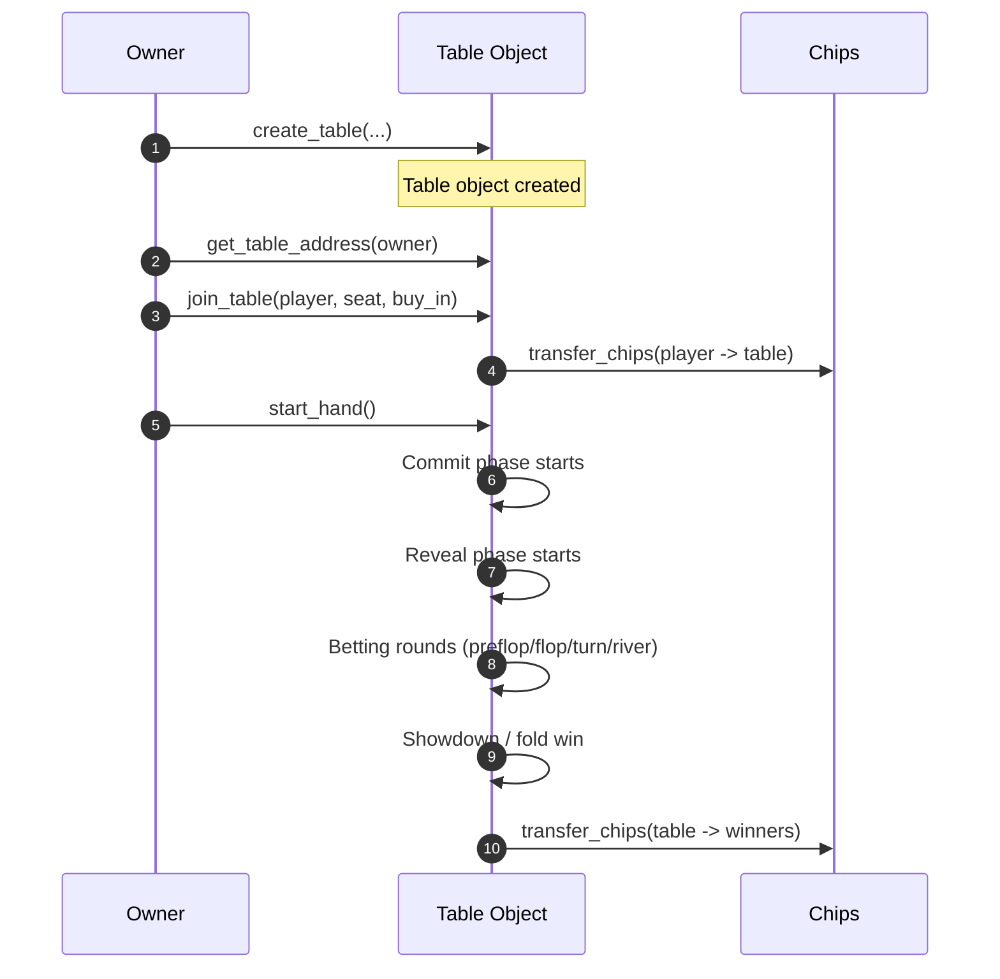
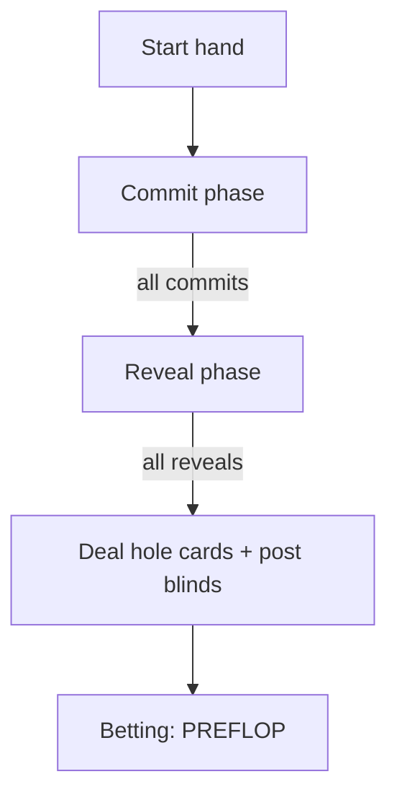
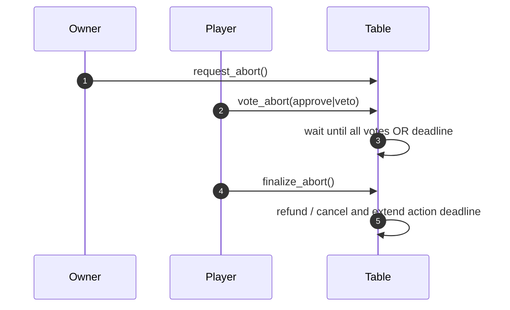

# NovaWallet Games — Full Contract Documentation (Texas Hold’em Suite)

This document is a **ground‑up, comprehensive rewrite** of the on‑chain Move contracts under `contracts/games`, with Texas Hold’em as the core game. It is intended to be the **authoritative functional spec** for developers, auditors, and integrators.

> Source of truth: `contracts/games/sources/*.move` and `contracts/games/sources/poker/*.move`.

---

## 0) Module Index

**Game & platform modules**
- `NovaWalletGames::poker_texas_holdem` — the Texas Hold’em game engine (tables, hands, betting, escrow)
- `NovaWalletGames::chips` — internal, non‑transferable chip ledger + economy controls
- `NovaWalletGames::game_registry` — capability‑based registry for new games
- `NovaWalletGames::core_events` — generic events for any game
- `NovaWalletGames::core_stats` — cross‑game player stats

**Poker‑specific modules**
- `NovaWalletGames::poker_events` — poker event schemas + emit helpers
- `NovaWalletGames::poker_pot_manager` — main/side pot accounting + distributions
- `NovaWalletGames::poker_hand_eval` — 7‑card hand evaluation
- `NovaWalletGames::poker_player_stats` — poker‑only lifetime stats
- `wallet::user_profiles` — optional wallet-level profile metadata (separate wallet package)

---

## 1) System Architecture (at a glance)



**Key idea:** Texas Hold’em uses its own event & stats modules, but also hooks into **core stats** (cross‑game) when the game is registered in `game_registry`.

---

## 2) On‑Chain Storage Model

### 2.1 Addresses & Core Objects

- `@NovaWalletGames` — module address; hosts global resources (`ChipManager`, `GameRegistry`, etc.).
- **Table Object Address** — each poker table is a **Move Object** with its own address.
- **Owner Address** — holds a `TableRef` pointing to the table object.

**Important:** Gameplay calls **always target the table object address**, not the owner address.

### 2.2 Storage Layout Diagram

```mermaid
flowchart LR
    Owner[Owner Address]
    TableRef[TableRef: table_address]
    Table[Table Object Address]
    TableResource[Table resource: config, seats, game, ...]

    Owner --> TableRef
    TableRef --> Table
    Table --> TableResource

    Player[Player Address] --> ChipAccount[ChipAccount]
    Player --> PlayerStats[PlayerStats]
    Player --> UserProfile[UserProfile (optional)]

    Root[@NovaWalletGames] --> ChipManager
    Root --> GameRegistry
```

---

## 3) Core Concepts You Must Understand

### 3.1 Seat Index vs Hand Index (critical)
- **Seat index**: fixed seat slot `0..max_seats-1`.
- **Hand index**: position inside `Game.players_in_hand` (only players active in the hand).

Most vectors during a hand are **hand‑indexed**, not seat‑indexed.
Use `get_players_in_hand(table_addr)` to map `hand_idx -> seat_idx`.

### 3.2 Card Encoding
- Cards are `u8` in `[0, 51]`.
- `rank = card % 13` (0=2, ..., 8=10, 9=J, 10=Q, 11=K, 12=A)
- `suit = card / 13` (0=Clubs, 1=Diamonds, 2=Hearts, 3=Spades)

### 3.3 Game Phases
```
0 WAITING
1 COMMIT
2 REVEAL
3 PREFLOP
4 FLOP
5 TURN
6 RIVER
7 SHOWDOWN
```

### 3.4 Player Status
```
0 WAITING
1 ACTIVE
2 FOLDED
3 ALL_IN
```

---

## 4) Poker Table and Game Data Structures

### 4.1 TableConfig
Fields:
- `small_blind`, `big_blind`
- `min_buy_in`, `max_buy_in`
- `ante` (0 = no ante)
- `straddle_enabled`
- `table_speed` (0=Standard, 1=Fast, 2=QuickFire)

### 4.2 Seat
- `player` address
- `chip_count` (on‑table stack)
- `is_sitting_out`

### 4.3 Game (active hand)
- `phase`
- `players_in_hand` (seat indices)
- `player_status`
- `pot_state` (from `poker_pot_manager`)
- `action_on`, `action_deadline`
- `dealer_position`, `min_raise`, `last_aggressor`
- `has_acted_mask`, `betting_reopened_for`
- `straddle_hand_idx`, `straddle_amount`
- `commits`, `secrets`
- `commit_deadline`, `reveal_deadline`
- `encrypted_hole_cards`, `community_cards`
- `card_seed`, `dealt_card_mask`, `card_keys`
- `revealed_mask` (audit for folded players revealing)

### 4.4 Table
- `config`, `owner`, `max_seats`, `name`, `color_index`
- `seats: vector<Option<Seat>>`
- `game: Option<Game>`
- `dealer_button`, `hand_number`
- `next_bb_seat`, `missed_blinds`, `dead_money`
- `is_paused`, `pending_leaves`, `owner_only_start`
- `extend_ref` (object control for chip escrow)
- `abort_request_timestamp`, `abort_approvals`, `abort_vetos`

### 4.5 TableRef
- `table_address` (one per owner)

### 4.6 TexasHoldemConfig (registry linkage)
- `game_capability`, `game_id` (stored at `@NovaWalletGames` after registration)

---

## 5) Table Lifecycle (End‑to‑End)



### 5.1 Table Creation
**Entry:** `create_table(owner, small_blind, big_blind, min_buy_in, max_buy_in, ante, straddle_enabled, max_seats, table_speed, name, color_index)`

Validations:
- `small_blind > 0`
- `big_blind > small_blind`
- `min_buy_in > 0`
- `max_buy_in >= min_buy_in`
- `max_buy_in <= chips::get_global_max_table_buy_in()`
- `max_seats == 5` (enforced)
- `table_speed <= SPEED_QUICK_FIRE`
- `name` length 3‑32, allowed chars `[A-Za-z0-9 _-]`
- `color_index <= 5`

Creates:
- **Table object** with all state.
- **TableRef** under owner address.

### 5.2 Join / Leave / Top‑Up
- `join_table(player, table_addr, seat_idx, buy_in)`
  - Table not paused, seat empty, buy‑in within min/max, address not already seated.
  - Transfers chips into the table escrow.
- `leave_table(player, table_addr)` — only between hands.
- `leave_after_hand` / `cancel_leave_after_hand` — mark/unmark for auto‑exit.
- `top_up(player, table_addr, amount)` — only between hands; stack must not exceed `max_buy_in`.

### 5.3 Sitting Out / Missed Blinds
- `sit_out` flags seat and records a missed big blind.
- `sit_in` clears sit‑out and **attempts** to deduct missed blind into `dead_money`.
- `dead_money` is added to the pot at hand start.

---

## 6) Hand Lifecycle in Detail

### 6.1 Phase Timing (by table speed)
`get_action_timeout(speed)`:
- Standard (0): 90s
- Fast (1): 60s
- QuickFire (2): 30s

`get_commit_reveal_timeout(speed)`:
- Standard (0): 180s
- Fast (1): 90s
- QuickFire (2): 45s

> Note: `ACTION_TIMEOUT_SECS` and `COMMIT_REVEAL_TIMEOUT_SECS` constants exist but are not used. Timeouts are derived from `table_speed`.

### 6.2 Commit → Reveal → Deal



**Commit phase**
- `submit_commit(player, table_addr, commit_hash)`
- `commit_hash` must be 32 bytes (SHA3‑256).
- Must be before `commit_deadline`.

**Reveal phase**
- `reveal_secret(player, table_addr, secret)`
- Secret length: 16‑32 bytes.
- Must satisfy `sha3_256(secret) == commit_hash`.

When all reveals are submitted:
1. Seed is constructed.
2. Hole cards are dealt and encrypted.
3. Antes/blinds are posted.
4. Betting enters PREFLOP.

---

## 7) Randomness & Card Dealing

### 7.1 Seed Construction
After all reveals:
1. Concatenate all secrets (hand‑index order).
2. Append `commit_deadline` and `reveal_deadline` (BCS).
3. Append `block_height` and `timestamp::now_seconds()` (BCS).
4. Hash with `sha3_256` to produce `card_seed`.

### 7.2 On‑Demand Card Generation
- `deal_card` hashes `card_seed` repeatedly.
- Uses the first two bytes to generate a value `0..51`.
- A 52‑bit `dealt_card_mask` prevents duplicates.

### 7.3 Street Entropy
Before FLOP/TURN/RIVER (and all‑in runouts) `add_street_entropy` re‑hashes:
- current `card_seed`
- current `block_height`
- current `timestamp`

---

## 8) Hole Card Encryption

### 8.1 Key Derivation
```
card_key = sha3_256(secret || "HOLECARDS" || BCS(u64 seat_idx))
```

### 8.2 Encryption
- Hole cards are XOR‑encrypted with `card_key`.
- `encrypted_hole_cards` is stored on‑chain.
- `card_keys` are stored for showdown decryption.
- `secrets` are cleared post‑deal for privacy.

### 8.3 Audit Reveal (Folded Players)
`reveal_hole_cards(player, table_addr)`
- Only for folded players during PREFLOP‑RIVER.
- Each player can reveal once (tracked by `revealed_mask`).

---

## 9) Betting Logic

### 9.1 Actions
- `fold`, `check`, `call`, `raise_to`, `all_in`, `straddle`

### 9.2 Raise Semantics
- `raise_to(total_bet)` sets a **total bet for the round**, not an increment.
- Must be `> max_current_bet` and `>= current_bet`.
- `min_raise` enforces minimum increments unless player is all‑in.
- Short all‑ins may **not** reopen betting; tracked via `betting_reopened_for`.

### 9.3 Straddle
- Only in PREFLOP, only if enabled.
- Must be UTG and only before any action.
- Posts `2 * big_blind` and sets `min_raise` accordingly.

### 9.4 Betting Round Completion
A round completes when:
- Every ACTIVE player has `has_acted_mask = true`, and
- Every ACTIVE player’s `current_bet` matches the max bet.

---

## 10) Pots & Showdown

### 10.1 Pot Manager
`poker_pot_manager` tracks:
- `current_bets`
- `total_invested`
- Side pots with eligible players

### 10.2 Distribution
`calculate_distribution`:
- Determines winners per pot.
- Splits chips equally.
- Remainders go to the winner closest to the dealer’s left.

### 10.3 Showdown
- Active/all‑in players decrypt hole cards.
- `poker_hand_eval` computes `(hand_type, tiebreaker)`.
- Winners receive chips into their seat stacks.
- `poker_player_stats` and `core_stats` (if registered) are updated.

**Result types:**
- `result_type = 0` showdown
- `result_type = 1` fold win

No fees/rake are applied in the current code.

---

## 11) Timeouts & Abort Flow

### 11.1 Timeouts
`handle_timeout(table_addr)`:
- COMMIT timeout → abort (reason `0`)
- REVEAL timeout → abort (reason `1`)
- ACTION timeout → auto‑fold `action_on`

### 11.2 Abort Voting (Owner‑initiated)



**Rules**
- `request_abort` (owner only) starts a 180s vote window.
- `vote_abort` can be called by any seated, **not sitting out** player.
- `finalize_abort` is public; succeeds immediately if unanimous approvals.
- If not unanimous, action deadline is extended and abort request is cleared.
- `cancel_abort_request` (owner only) clears the request and extends the action deadline by time spent voting.

**Action lock during abort:**
`fold`, `check`, `call`, `raise_to`, and `handle_timeout` are blocked.
`all_in` and `straddle` do **not** enforce the abort lock in current code.

---

## 12) Chips Module (Economy Layer)

### 12.1 Core Properties
- Internal ledger (not a token standard, non‑transferable by users).
- Free claims (periodic) + paid multipliers.
- CEDRA paid for multipliers accumulates in treasury.

### 12.2 Multipliers
- `purchase_multiplier(player, factor)`
- Upgrades only (`factor` must increase).
- Upgrade cost is pro‑rated; duration does **not** extend on upgrade.

### 12.3 Free Claims
- `claim_free_chips(player)`
- Enforced by `free_claim_period_seconds` and `daily_free_amount`.

### 12.4 Game Transfers
- `transfer_chips(from, to, amount)` — **friend only** (used by poker)
- `transfer_chips_with_cap(cap, from, to, amount)` — capability‑based, for new games

---

## 13) Event Emission (Actual vs Defined)

### 13.1 Emitted by `poker_texas_holdem`
- `TableCreated`, `TableClosed`
- `PlayerJoined`, `PlayerLeft`, `PlayerSatOut`, `PlayerSatIn`, `PlayerToppedUp`, `PlayerKicked`
- `OwnershipTransferred`
- `HandStarted`, `HandResult`, `HandAborted`
- `AbortRequested`, `AbortVoteCast`, `AbortRequestCancelled`
- `HoleCardsRevealed`

### 13.2 Defined but not emitted by current logic
(These exist in `poker_events` but are not currently emitted by the main module.)
- `CommitSubmitted`, `RevealSubmitted`, `CardsDealt`, `PhaseChanged`, `CommunityCardsDealt`
- `BlindsPosted`, `AntesPosted`, `StraddlePosted`
- `PlayerFolded`, `PlayerChecked`, `PlayerCalled`, `PlayerRaised`, `PlayerWentAllIn`
- `ShowdownStarted`, `PotAwarded`, `HandEnded`, `FoldWin`
- `TimeoutTriggered`, `TableMetadataUpdated`, `TableConfigUpdated`

---

## 14) View Functions (Poker)

**Table configuration & status**
- `get_table_config`, `get_table_config_full`
- `get_table_state`, `get_table_summary`
- `get_table_address(owner_addr)`
- `get_owner(table_addr)`
- `is_table_paused`, `is_paused`
- `is_owner_only_start`
- `get_table_speed`, `get_action_timeout_secs`

**Seats**
- `get_seat_info`, `get_seat_info_full`
- `get_seat_count`
- `get_player_seat`

**Hand & action**
- `get_game_phase`
- `get_action_on`, `get_action_deadline`
- `get_min_raise`, `get_max_current_bet`, `get_call_amount`
- `get_current_bets`, `get_total_invested`
- `get_last_aggressor`

**Cards & status**
- `get_community_cards`
- `get_encrypted_hole_cards`
- `get_players_in_hand`
- `get_player_statuses`
- `get_commit_status`, `get_reveal_status`
- `get_commit_deadline`, `get_reveal_deadline`

**Misc**
- `get_timeout_penalty_percent`
- `get_missed_blinds`, `get_dead_money`, `get_pending_leaves`
- `get_abort_request_status`

---

## 15) Error Codes (Poker)

| Code | Name | Meaning |
| --- | --- | --- |
| 1 | E_NOT_ADMIN | Caller is not table owner |
| 2 | E_TABLE_EXISTS | Owner already has a TableRef |
| 3 | E_TABLE_NOT_FOUND | Table or TableRef missing |
| 4 | E_SEAT_TAKEN | Seat already occupied |
| 5 | E_NOT_AT_TABLE | Caller not seated |
| 6 | E_GAME_IN_PROGRESS | Hand active when not allowed |
| 7 | E_NO_GAME | No active hand |
| 8 | E_NOT_YOUR_TURN | Not current actor |
| 9 | E_INVALID_ACTION | Action not allowed |
| 10 | E_INSUFFICIENT_CHIPS | Not enough chips |
| 11 | E_INVALID_RAISE | Raise violates min/total rules |
| 12 | E_NOT_ENOUGH_PLAYERS | Fewer than 2 active seats |
| 13 | E_ALREADY_COMMITTED | Commit already submitted |
| 15 | E_INVALID_SECRET | Secret hash mismatch |
| 16 | E_WRONG_PHASE | Wrong game phase |
| 17 | E_TABLE_FULL | Seat index out of range |
| 18 | E_BUY_IN_TOO_LOW | Below min buy‑in |
| 19 | E_BUY_IN_TOO_HIGH | Above max buy‑in or global cap |
| 20 | E_ALREADY_REVEALED | Secret/cards already revealed |
| 21 | E_NO_TIMEOUT | Deadline not reached |
| 22 | E_STRADDLE_NOT_ALLOWED | Straddles disabled |
| 23 | E_STRADDLE_ALREADY_POSTED | Straddle already posted |
| 24 | E_NOT_UTG | Not UTG for straddle |
| 25 | E_INVALID_BLINDS | Big blind <= small blind |
| 26 | E_INVALID_BUY_IN | Max buy‑in < min buy‑in |
| 27 | E_ZERO_VALUE | Value must be > 0 |
| 31 | E_INVALID_COMMIT_SIZE | Commit not 32 bytes |
| 32 | E_INVALID_SECRET_SIZE | Secret not 16‑32 bytes |
| 33 | E_ALREADY_SEATED | Address already seated |
| 34 | E_INVALID_SEAT_COUNT | Seat count invalid (must be 5) |
| 35 | E_INVALID_SPEED | Invalid table speed |
| 36 | E_ABORT_REQUEST_EXISTS | Abort already requested |
| 37 | E_NO_ABORT_REQUEST | No abort request pending |
| 38 | E_ALREADY_VOTED | Player already voted |
| 39 | E_ABORT_DELAY_NOT_PASSED | Vote delay not over |
| 40 | E_ABORT_VETOED | Abort not unanimous |
| 41 | E_VOTES_PENDING | Votes missing before deadline |
| 42 | E_ABORT_PENDING | Actions locked during abort vote |
| 43 | E_INVALID_NAME_LENGTH | Name length invalid |
| 44 | E_INVALID_NAME_CHAR | Name contains invalid char |
| 45 | E_INVALID_COLOR_INDEX | Color index out of range |

---

## 16) Error Codes (Chips)

| Code | Name | Meaning |
| --- | --- | --- |
| 1 | E_ALREADY_INITIALIZED | ChipManager already exists |
| 2 | E_NOT_INITIALIZED | ChipManager missing |
| 3 | E_NOT_ADMIN | Caller not admin |
| 4 | E_NOT_PRIMARY_ADMIN | Caller not primary admin |
| 6 | E_ZERO_AMOUNT | Amount must be > 0 |
| 7 | E_TREASURY_INSUFFICIENT | Treasury balance too low |
| 9 | E_ALREADY_CLAIMED_THIS_PERIOD | Free claim already used |
| 11 | E_FREE_CLAIM_DISABLED | Daily free amount is 0 |
| 12 | E_INSUFFICIENT_BALANCE | Not enough chips |
| 13 | E_UNAUTHORIZED_GAME | Invalid/inactive capability |
| 14 | E_SELF_APPROVAL | Multisig self‑approval not allowed |
| 15 | E_REQUEST_NOT_FOUND | Request not found |
| 16 | E_INVALID_MULTIPLIER | Multiplier not offered |
| 17 | E_CANNOT_DOWNGRADE | Downgrade or mis‑priced upgrade |

---

## 17) User Profiles (Optional, Wallet Package)

Profiles are no longer hosted in the games package.
Use `wallet::user_profiles` in `contracts/wallet`.

**Wallet Entry**
- `wallet::user_profiles::set_profile(account, nickname, avatar_url)`
- `wallet::user_profiles::clear_profile(account)`

**Constraints**
- `nickname`: 1–20 bytes
- `avatar_url`: 0–256 bytes

**Wallet View**
- `wallet::user_profiles::has_profile`
- `wallet::user_profiles::get_profile`
- `wallet::user_profiles::get_nickname`
- `wallet::user_profiles::get_avatar_url`

---

## 18) Integration Notes

- **Table address is mandatory** for every gameplay call.
- **Secrets must be stored client‑side** until reveal and optional card decrypt.
- **Abort votes lock most actions**; do not rely on hardcoded timeouts.
- **No fees** exist in the current poker implementation (fee fields are placeholders).

---

If you want a line‑by‑line contract spec (per function signature with pre/post conditions), request the **Formal ABI Spec** and I’ll generate it.
