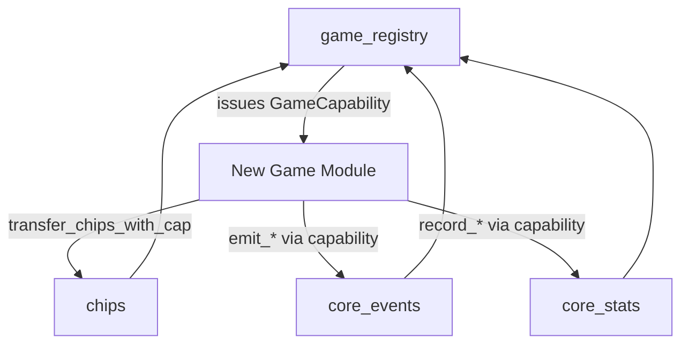
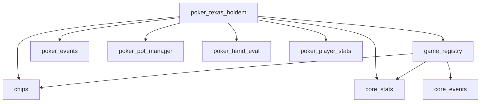

# Game Extensibility Guide (Capability‑Based Registry)

This guide documents the **current, on‑chain extensibility model** for adding new games to NovaWallet’s Move contracts. It reflects the **actual modules and APIs** in `contracts/games/sources`.

---

## 1) Why the Registry Exists

Originally, the chip ledger (`chips.move`) relied on `friend` access from `poker_texas_holdem`. That approach makes every new game require an upgrade to `chips` to add new friend modules.

To avoid that, the system adds a **capability‑based registry**:
- New games register once and receive a **GameCapability**.
- The capability authorizes chip transfers without modifying `chips`.
- Games can be **deactivated** by the registry admin (capability invalidation).

---

## 2) Architecture Overview



**Key idea:** `game_registry::verify_capability` is the shared gate for chip transfers and core events/stats.

---

## 3) Modules You Must Know

### 3.1 `game_registry.move`
**Purpose:** Authorize games and issue capabilities.

**Core types**
- `GameRegistry` — stored at `@NovaWalletGames`
- `GameCapability` — stored by each game
- `GameInfo` — registry metadata

**Key functions**
- `register_game(admin, name, requires_treasury) -> GameCapability`
- `deactivate_game(admin, game_id)`
- `unregister_game(admin, game_id)` *(alias of `deactivate_game`)*
- `reactivate_game(admin, game_id)`
- `verify_capability(cap) -> bool`
- `get_active_game_entries() -> (vector<u64>, vector<String>)`

**Events**
- `GameRegistered`, `GameDeactivated`, `GameReactivated`, `RegistryAdminChanged`

---

### 3.2 `chips.move`
**Purpose:** Internal ledger for all chip‑based games.

**Transfers**
- `transfer_chips(from, to, amount)` — **friend‑only** (legacy; used by poker)
- `transfer_chips_with_cap(cap, from, to, amount)` — **preferred** for new games

---

### 3.3 `core_events.move`
**Purpose:** Generic event schemas for any game.

**Usage:** Games call `core_events::emit_*` with a `GameCapability` to emit:
- table lifecycle
- player actions
- round results
- timeouts and aborts

---

### 3.4 `core_stats.move`
**Purpose:** Cross‑game player statistics.

**Usage:** Games call:
- `try_initialize(player)`
- `record_participation(cap, player)`
- `record_win(cap, player, amount)`

*(See module for complete list.)*

---

## 4) Extending with a New Game (Step‑by‑Step)

### Step 1: Implement your game module
Create a new module (example: `blackjack.move`).

```move
module NovaWalletGames::blackjack {
    use std::string;
    use std::signer;
    use NovaWalletGames::game_registry::{Self, GameCapability};
    use NovaWalletGames::chips;
    use NovaWalletGames::core_events;
    use NovaWalletGames::core_stats;

    struct BlackjackConfig has key {
        game_capability: GameCapability,
        game_id: u64,
    }

    public entry fun register_game(admin: &signer) {
        let cap = game_registry::register_game(
            admin,
            string::utf8(b"Blackjack"),
            false
        );
        let id = game_registry::get_game_id(&cap);
        move_to(admin, BlackjackConfig { game_capability: cap, game_id: id });
    }

    public entry fun join_table(player: &signer, table_addr: address, buy_in: u64)
    acquires BlackjackConfig {
        let cfg = borrow_global<BlackjackConfig>(@NovaWalletGames);
        let player_addr = signer::address_of(player);

        core_stats::try_initialize(player);
        chips::transfer_chips_with_cap(&cfg.game_capability, player_addr, table_addr, buy_in);
        core_events::emit_player_joined(&cfg.game_capability, table_addr, player_addr, 0, buy_in);
    }
}
```

### Step 2: Emit core events (recommended)
Use `core_events` to provide a uniform event stream for indexers.

### Step 3: Record cross‑game stats (optional, but recommended)
Use `core_stats` to track player participation and wins across games.

### Step 4: Register the game on chain
```
cedra move run --function-id 'NovaWalletGames::blackjack::register_game'
```

---

## 5) Design Notes for New Compatible Games (Extensive)

This section is a practical design guide for developers building a new game that is fully compatible with the NovaWallet games stack.

### 5.1 Compatibility Contract (what “compatible” means)

A game is considered compatible when it does all of the following:
- Registers with `game_registry` and stores `GameCapability` in module-owned config.
- Uses capability-authorized chip paths in `chips.move` instead of new friend links.
- Emits core lifecycle/player/round events through `core_events`.
- Records participation/wins through `core_stats`.
- Exposes stable `#[view]` read models for frontend/indexer consumers.
- Has admin safety controls (pause/deactivate path, clear authority boundaries).

If a module skips most of the above, it may still function but should be treated as a custom integration, not a standard compatible game.

### 5.2 Pick an economy model first

Choose one of these before writing game logic:
- Player-vs-player escrow model:
  - Chips move between players/table addresses using `transfer_chips_with_cap`.
  - No chip treasury dependency required.
  - Register with `requires_treasury = false`.
- House-backed model (casino style):
  - Stakes are collected into chip treasury and winnings paid from treasury.
  - Use `deposit_house_takings_with_cap`, `collect_to_treasury_with_cap`, and `payout_from_treasury_with_cap`.
  - Register with `requires_treasury = true`.
  - Always validate treasury sufficiency before accepting risk.

### 5.3 Capability lifecycle and storage pattern

Recommended pattern:
- `register_game(admin)` entry acquires/creates a module config resource.
- Config stores:
  - `game_capability: GameCapability`
  - `game_id: u64`
  - game-level counters (round nonce, totals, config version)
- Gameplay entries borrow config and pass `&game_capability` into chips/events/stats calls.

Important:
- Keep capability in module-owned global state, not in user resources.
- Treat `unregister_game`/`deactivate_game` as emergency brake for new value flow.
- Deactivation should stop future chip operations automatically via capability checks.

### 5.4 State model recommendations

Use a layered state model:
- Module config resource:
  - game capability/id, admin, global params, aggregate counters.
- Instance resources:
  - table/lobby/match objects if game is multi-session.
- Ephemeral round state:
  - round id, participants, commitments/reveals/randomness outputs, settlement status.

Guidelines:
- Keep immutable facts separate from mutable operational state.
- Add explicit phase/status enums (u8 constants) for all state transitions.
- Favor “single writer” transitions: one entry function should own one transition.
- Store monotonic counters (`next_round_id`, `nonce`) to support deterministic indexing.

### 5.5 Core invariants to enforce

At minimum, enforce these invariants:
- No negative or underflowing balances in any path.
- Sum conservation for P2P flow: value debited equals value credited plus explicit fees.
- House flow correctness: treasury deltas match modeled payouts/takings.
- Round finality: each round settles once, no double payout.
- Authorization boundaries:
  - admin-only entries check signer address.
  - player action entries validate actor is an active participant.
- Idempotency where needed:
  - timeout/abort handlers should be safe if called multiple times.

### 5.6 Event design strategy

Emit both:
- Core events from `core_events` for shared indexing/analytics.
- Game-specific events for domain details (cards, RNG internals, turn details, etc.).

Event schema guidance:
- Include `game_id`, `table_addr` (or equivalent instance address), and `round_number`.
- Keep amounts explicit (`bet_amount`, `payout_amount`, `fee_amount`) rather than inferred.
- Emit one terminal event per round (`GameRoundEnded`/`GameRoundResult` equivalent).
- Avoid ambiguous “status changed” events without before/after context.

### 5.7 Stats integration strategy

Use `core_stats` as baseline cross-game analytics:
- Call `core_stats::try_initialize` when players first enter flow.
- Call `record_participation` once per round participation.
- Call `record_win` only for actual wins and the intended amount semantics.

Semantics recommendation:
- Document whether `record_win(amount)` is net profit or gross payout proxy.
- Keep that choice consistent in all settlement paths.

### 5.8 View/API design for frontend and indexers

Expose stable read functions with explicit tuple shapes:
- registration status and game id.
- current phase/status.
- per-instance summary.
- per-player position/balance/status.
- aggregate game metrics.

Read-model rules:
- Return safe defaults when uninitialized (`0`, empty vectors, `false`).
- Keep field ordering stable once clients depend on it.
- Prefer dedicated summary views over forcing many granular calls.
- For registry display, consumers should use:
  - `game_registry::get_active_game_entries()` for IDs plus names.

### 5.9 Randomness and fairness design

If randomness is used:
- Prefer commit-reveal or framework randomness patterns already used in repo.
- Tie randomness to round nonce/context so outputs are round-specific.
- Prevent replay by incrementing nonce before/after terminal transitions as appropriate.
- Handle timeout/non-reveal scenarios explicitly with deterministic fallback rules.

### 5.10 Abort and emergency controls

Provide operational controls before launch:
- pause/resume for new entries.
- bounded abort logic for stuck rounds.
- admin-driven emergency deactivation via registry (`unregister_game`).

Design rule:
- Emergency paths should preserve funds safety first; UX continuity second.

### 5.11 Error code design

Use module-local error namespaces and stable meanings:
- authorization errors
- phase/state errors
- input validation errors
- economic sufficiency errors
- registration/config errors

Guidelines:
- Keep one meaning per error code.
- Reuse the same code across equivalent failure branches.
- Document every public-entry abort condition in module docs.

### 5.12 Testing matrix (required before publish)

Minimum test coverage:
- Registration lifecycle:
  - register success
  - duplicate register fails
  - deactivate/unregister blocks capability-based operations
  - reactivate restores operations
- Economy:
  - happy path settlement
  - insufficient balance/treasury paths
  - zero and boundary amounts
- State machine:
  - valid phase transitions
  - invalid transitions abort
  - timeout/abort behavior
- Security:
  - non-admin cannot call admin entries
  - non-participant cannot take participant actions
- Views:
  - defaults before init
  - expected tuples after key transitions

Recommended additional coverage:
- fuzz-like tests for random or branching game states.
- event assertions for critical round lifecycle emissions.

### 5.13 Upgrade and migration notes

Plan for upgrades early:
- avoid storing redundant derived state that is hard to migrate.
- version critical config/resource structs when shape changes are expected.
- add migration entries guarded by admin/upgrade authority.
- keep old read-model compatibility when frontend/indexer already consumes fields.

### 5.14 Launch checklist for a new game

Before mainnet publish:
- `game_registry` and `chips` are initialized on target network.
- game registration entry has been run and capability stored.
- `requires_treasury` flag matches your actual chip flow design.
- core events and stats are wired in tested paths.
- fail-safe controls (pause/abort/deactivate) are verified.
- frontend uses registry names (`get_active_game_entries`) for display.
- integration docs include entry functions, views, and expected event flow.

### 5.15 Admin dashboard design notes (game registry)

This subsection describes a production-ready admin dashboard for operating `NovaWalletGames::game_registry`.

#### A) Dashboard scope and roles

Minimum roles:
- Registry Admin:
  - register games
  - deactivate/unregister games
  - reactivate games
  - rotate registry admin
- Read-only Operator:
  - inspect registry status and game metadata
  - monitor active/inactive games and audit history

Implementation note:
- Always derive authority from wallet address on chain (`get_admin`) instead of local role flags.

#### B) Required on-chain read model

At app load:
- `is_initialized()`:
  - blocks action UI if false
- `get_admin()`:
  - determines whether connected wallet can mutate state
- `get_game_count()`:
  - overview metric

Registry list screen:
- preferred:
  - `get_active_game_entries()` for user-facing active game table
- full inventory:
  - `get_all_game_ids()` then `get_game_info_extended(game_id)` per id
  - render:
    - `game_id`
    - `name`
    - `is_active`
    - `registered_at`
    - `requires_treasury`

Game detail panel:
- `get_game_info_extended(game_id)`
- `is_game_active(game_id)`
- `game_requires_treasury(game_id)`

UI consistency rules:
- display both `game_id` and `name` everywhere to avoid ambiguous actions.
- treat empty-name return values as not-found rows.

#### C) Required write actions and wiring

Register game:
- function:
  - `NovaWalletGames::game_registry::register_game`
- args:
  - `string:name`
  - `bool:requires_treasury`
- UX:
  - validate non-empty name and <= 64 chars before submit.
  - show duplicate-name failure as user-facing error.

Unregister/deactivate game:
- preferred function:
  - `NovaWalletGames::game_registry::unregister_game`
- compatibility fallback:
  - `NovaWalletGames::game_registry::deactivate_game`
- args:
  - `u64:game_id`
- UX:
  - require explicit confirmation with typed `game_id`.

Reactivate game:
- function:
  - `NovaWalletGames::game_registry::reactivate_game`
- args:
  - `u64:game_id`

Rotate admin:
- function:
  - `NovaWalletGames::game_registry::set_admin`
- args:
  - `address:new_admin`
- UX:
  - two-step confirmation (preview + final).
  - block if new admin equals current admin.

#### D) Transaction UX and reliability

For every write action:
- preflight:
  - check connected wallet == `get_admin()`
  - check registry initialized
  - check target game exists (for deactivate/reactivate)
- submission:
  - capture tx hash and display explorer link
- post-submit:
  - poll tx status until success/failure
  - refresh read model from chain after success

Failure handling recommendations:
- classify errors into:
  - auth errors (`E_NOT_ADMIN`)
  - missing game (`E_GAME_NOT_FOUND`)
  - duplicate name (`E_GAME_NAME_EXISTS`)
  - not initialized (`E_NOT_INITIALIZED`)
- map each to actionable UI copy; avoid raw VM status in primary UI.

#### E) Event and audit integration

Registry emits:
- `GameRegistered`
- `GameDeactivated`
- `GameReactivated`
- `RegistryAdminChanged`

Dashboard should include an audit timeline with:
- action type
- game id/name (if applicable)
- operator address
- timestamp
- tx hash

If indexer data lags:
- prefer chain view functions for current state.
- mark event timeline as eventually consistent.

#### F) Suggested screen layout

Recommended sections:
- Registry Overview:
  - initialized status
  - current admin
  - total games
  - active games count
- Game Catalog:
  - searchable table (`id`, `name`, `active`, `treasury-enabled`, `registered_at`)
- Actions Panel:
  - register
  - unregister/deactivate
  - reactivate
  - rotate admin
- Audit Feed:
  - latest registry events with tx links

#### G) Operational safeguards

Add these safeguards in dashboard logic:
- do not expose mutate buttons to non-admin wallets.
- disable all writes while a prior tx is pending.
- require typed confirmation for destructive actions.
- include network badge (Testnet/Mainnet) in header to prevent mis-ops.
- support feature flag:
  - if `unregister_game` is unavailable on an older deployment, use `deactivate_game`.

---

## 6) Texas Hold’em Compatibility

Texas Hold’em already includes a **built‑in registry hook**:
- `poker_texas_holdem::register_game` registers poker with the registry
- When registered, the module will **record core stats** using the stored capability

The poker module still works without registration due to its legacy `friend` transfer.

---

## 7) Security & Operational Notes

- **Capabilities are copyable** and can be stored in resources—keep them in module‑owned config resources.
- **Deactivating/unregistering a game** makes all future `transfer_chips_with_cap` calls fail.
- **Registry admin** is a single address; rotate with `set_admin` (see `game_registry.move`).
- **No game can mint chips**: it can only move balances inside the ledger.
- For frontend/indexers, prefer `get_active_game_entries()` over `get_active_game_ids()` when you need user-facing names.

---

## 8) Dependency Graph



---

If you want a checklist for adding a game (tests, indexer, UI requirements), ask for the **New Game Integration Checklist**.
